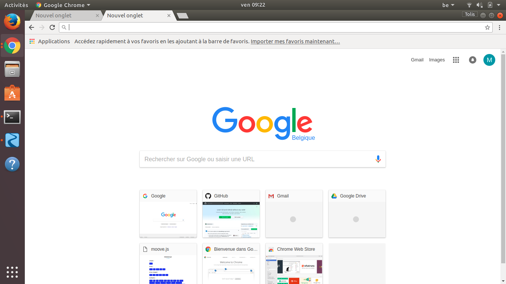

# markdown-warmup

## First GitHub Exercice

Wich site website ?  -[This one](http://theworldsworstwebsiteever.com/new_page_1.htm)

Is it updated frequently ?  -No, the last update was on April 2012.

How did you find it ?   -[Let me google that for you](http://lmgtfy.com/?q=bad+optimized+websites)
    
Why this website needs updates or a remake ?    -No apparent structure, it's not pleasant to watch, kind of primitive.

Is this website present on social networks ?    -No, it is'nt.

Make a list of recomandation of the futur changes ?     -Change the header, make it look better, add more images...

With your group, present your markdown and the website.
uihihifs

# test image

# Test Screenshot

# Access the webpage

(https://thankuniverse.github.io/markdown-warmup/)
